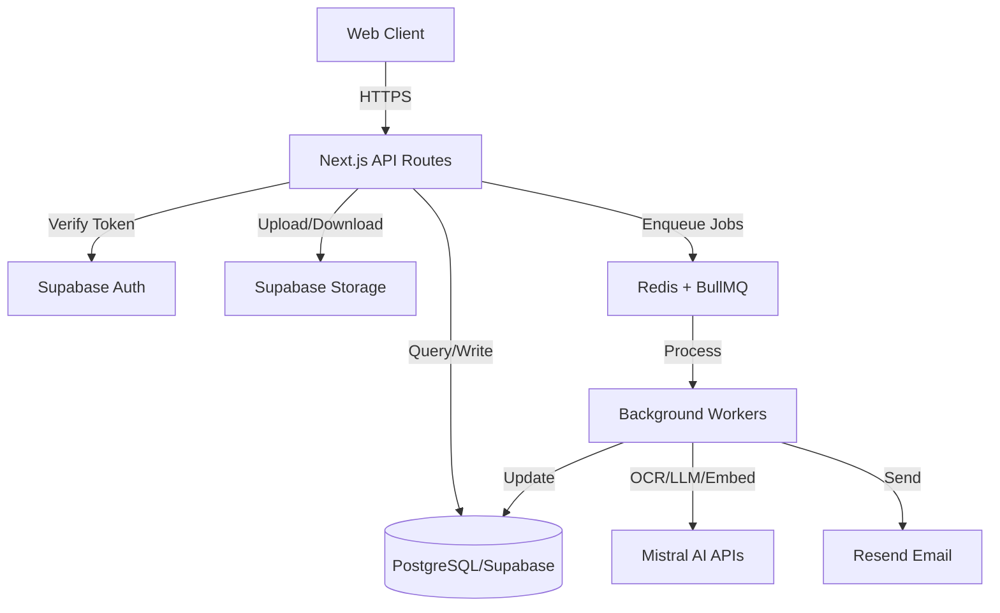
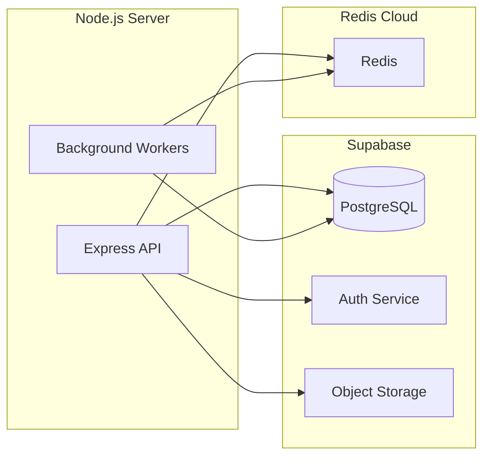

# Design Document

## Overview

HealthTrack MVP backend is a Node.js/TypeScript API service built with Next.js API routes that provides health report tracking capabilities. The system processes medical checkup PDFs through OCR, extracts structured biomarker data, maintains Living Health Markdown (LHM) documents per profile, and provides intelligent insights through RAG-powered Q&A and automated email digests.

The architecture follows a modular, service-oriented design with clear separation of concerns:
- API layer handles HTTP requests and authentication
- Service layer contains business logic and orchestration
- Repository layer abstracts database operations
- External integrations are isolated in dedicated modules

## Architecture

### System Context



### Technology Stack

| Layer | Technology | Rationale |
|-------|-----------|-----------|
| Runtime | Node.js 20+ | Modern LTS with native TypeScript support |
| Framework | Express.js | Lightweight, flexible, production-ready |
| Language | TypeScript 5+ | Type safety, better DX, reduced runtime errors |
| Database | PostgreSQL (Supabase) | Relational data, free tier, pgvector extension |
| Auth | Supabase Auth | Built-in OAuth, session management, RLS |
| Storage | Supabase Storage | Integrated with Supabase, S3-compatible |
| Job Queue | BullMQ + Redis | Reliable async processing, retries, scheduling |
| OCR | Mistral OCR API | Best-in-class PDF understanding, table extraction |
| LLM | Mistral Chat API | Summaries, Q&A, report analysis |
| Embeddings | Mistral Embed API | 1024-dim vectors for RAG |
| Vector Store | pgvector (Supabase) | Native PostgreSQL extension, no extra service |
| Email | Resend | React Email templates, generous free tier |
| Validation | Zod | Runtime type validation, schema generation |

### Deployment Architecture



## Components and Interfaces

### API Layer Structure (Following hire-right-backend Pattern)

```
src/
├── controllers/            # HTTP request handlers (organized by feature)
│   ├── auth/
│   │   ├── index.ts
│   │   └── get.controller.ts
│   ├── profile/
│   │   ├── index.ts
│   │   ├── get.controller.ts
│   │   ├── post.controller.ts
│   │   ├── patch.controller.ts
│   │   └── delete.controller.ts
│   ├── report/
│   │   ├── index.ts
│   │   ├── get.controller.ts
│   │   ├── post.controller.ts
│   │   └── delete.controller.ts
│   ├── dashboard/
│   │   ├── index.ts
│   │   └── get.controller.ts
│   ├── biomarker/
│   │   ├── index.ts
│   │   └── get.controller.ts
│   ├── chat/
│   │   ├── index.ts
│   │   └── post.controller.ts
│   └── notification/
│       ├── index.ts
│       ├── get.controller.ts
│       └── patch.controller.ts
├── services/               # Business logic layer
│   ├── auth.service.ts
│   ├── profile.service.ts
│   ├── report.service.ts
│   ├── biomarker.service.ts
│   ├── lhm.service.ts
│   ├── chat.service.ts
│   ├── notification.service.ts
│   ├── supabase.service.ts
│   ├── mistral-ocr.service.ts
│   ├── mistral-chat.service.ts
│   ├── mistral-embed.service.ts
│   ├── email.service.ts
│   └── queue.service.ts
├── routes/                 # Route definitions
│   ├── auth.routes.ts
│   ├── profile.routes.ts
│   ├── report.routes.ts
│   ├── dashboard.routes.ts
│   ├── biomarker.routes.ts
│   ├── chat.routes.ts
│   └── notification.routes.ts
├── middlewares/            # Express middleware
│   ├── auth.middleware.ts
│   ├── error.middleware.ts
│   └── validation.middleware.ts
├── validations/            # Zod validation schemas
│   ├── profile.validations.ts
│   ├── report.validations.ts
│   ├── biomarker.validations.ts
│   └── notification.validations.ts
├── types/                  # TypeScript type definitions
│   ├── profile.types.ts
│   ├── report.types.ts
│   ├── biomarker.types.ts
│   ├── lhm.types.ts
│   └── database-schema.ts
├── utils/                  # Utility functions
│   ├── biomarker-normalizer.ts
│   ├── lhm-validator.ts
│   ├── httpError.ts
│   └── logger.ts
├── workers/                # Background job processors
│   ├── process-report.worker.ts
│   ├── update-lhm.worker.ts
│   ├── generate-embeddings.worker.ts
│   └── send-digest.worker.ts
├── constant/               # Constants and configurations
│   ├── biomarker-aliases.ts
│   └── lhm-templates.ts
├── supabase/
│   └── migrations/         # Supabase SQL migrations
│       ├── 001_initial_schema.sql
│       ├── 002_seed_biomarker_definitions.sql
│       └── 003_rls_policies.sql
└── server.ts               # Application entry point
```

### Core Service Interfaces

```typescript
// service/profile.service.ts
export interface ProfileService {
  createProfile(userId: string, data: CreateProfileDto): Promise<Profile>;
  getProfiles(userId: string): Promise<Profile[]>;
  getProfileById(userId: string, profileId: string): Promise<Profile>;
  updateProfile(userId: string, profileId: string, data: UpdateProfileDto): Promise<Profile>;
  deleteProfile(userId: string, profileId: string): Promise<void>;
}

// service/report.service.ts
export interface ReportService {
  uploadReport(userId: string, profileId: string, file: Express.Multer.File, reportDate?: Date): Promise<Report>;
  getReports(userId: string, profileId: string): Promise<Report[]>;
  getReportById(userId: string, reportId: string): Promise<Report>;
  deleteReport(userId: string, reportId: string): Promise<void>;
  processReport(reportId: string): Promise<void>;
}

// service/lhm.service.ts
export interface LHMService {
  initializeLHM(profileId: string, userId: string): Promise<void>;
  updateLHM(profileId: string, newBiomarkers: Biomarker[], reportDate: Date): Promise<void>;
  getLHM(profileId: string): Promise<LHMDocument>;
  compressLHM(profileId: string): Promise<void>;
  validateLHM(newMarkdown: string, oldMarkdown: string, newBiomarkers: Biomarker[]): boolean;
}

// service/chat.service.ts
export interface ChatService {
  chat(userId: string, message: string, profileId?: string): AsyncGenerator<string>;
  detectProfile(message: string, userProfiles: Profile[]): Profile | null;
}
```

### Controller Pattern (Following hire-right-backend)

```typescript
// controllers/profile/get.controller.ts
import { Request, Response, NextFunction } from 'express';
import { ProfileService } from '../../services/profile.service';
import { HttpError } from '../../utils/httpError';

const profileService = new ProfileService();

// GET /api/profiles
export async function getProfiles(req: Request, res: Response, next: NextFunction) {
  try {
    const userId = req.user!.id;
    const profiles = await profileService.getProfiles(userId);
    res.json({ profiles });
  } catch (error) {
    next(error);
  }
}

// GET /api/profiles/:id
export async function getProfile(req: Request, res: Response, next: NextFunction) {
  try {
    const userId = req.user!.id;
    const profileId = req.params.id;
    const profile = await profileService.getProfileById(userId, profileId);
    res.json({ profile });
  } catch (error) {
    next(error);
  }
}

// controllers/profile/post.controller.ts
export async function createProfile(req: Request, res: Response, next: NextFunction) {
  try {
    const userId = req.user!.id;
    const profile = await profileService.createProfile(userId, req.body);
    res.status(201).json({ profile });
  } catch (error) {
    next(error);
  }
}

// controllers/profile/patch.controller.ts
export async function updateProfile(req: Request, res: Response, next: NextFunction) {
  try {
    const userId = req.user!.id;
    const profileId = req.params.id;
    const profile = await profileService.updateProfile(userId, profileId, req.body);
    res.json({ profile });
  } catch (error) {
    next(error);
  }
}

// controllers/profile/delete.controller.ts
export async function deleteProfile(req: Request, res: Response, next: NextFunction) {
  try {
    const userId = req.user!.id;
    const profileId = req.params.id;
    await profileService.deleteProfile(userId, profileId);
    res.status(204).send();
  } catch (error) {
    next(error);
  }
}

// controllers/profile/index.ts
export * from './get.controller';
export * from './post.controller';
export * from './patch.controller';
export * from './delete.controller';
```

### Route Setup

```typescript
// routes/profile.routes.ts
import { Router } from 'express';
import * as profileController from '../controllers/profile';
import { authMiddleware } from '../middlewares/auth.middleware';
import { validateRequest } from '../middlewares/validation.middleware';
import { createProfileSchema, updateProfileSchema } from '../validations/profile.validations';

const router = Router();

router.get('/', authMiddleware, profileController.getProfiles);
router.post('/', authMiddleware, validateRequest(createProfileSchema), profileController.createProfile);
router.get('/:id', authMiddleware, profileController.getProfile);
router.patch('/:id', authMiddleware, validateRequest(updateProfileSchema), profileController.updateProfile);
router.delete('/:id', authMiddleware, profileController.deleteProfile);

export default router;
```

### Main Application Setup

```typescript
// server.ts
import express from 'express';
import cors from 'cors';
import helmet from 'helmet';
import profileRoutes from './routes/profile.routes';
import reportRoutes from './routes/report.routes';
import dashboardRoutes from './routes/dashboard.routes';
import biomarkerRoutes from './routes/biomarker.routes';
import chatRoutes from './routes/chat.routes';
import notificationRoutes from './routes/notification.routes';
import { errorMiddleware } from './middlewares/error.middleware';

const app = express();

// Middleware
app.use(helmet());
app.use(cors());
app.use(express.json());

// Routes
app.use('/api/profiles', profileRoutes);
app.use('/api/reports', reportRoutes);
app.use('/api/dashboard', dashboardRoutes);
app.use('/api/biomarkers', biomarkerRoutes);
app.use('/api/chat', chatRoutes);
app.use('/api/settings/notifications', notificationRoutes);

// Error handling
app.use(errorMiddleware);

// Start server
const port = process.env.PORT || 3000;
app.listen(port, () => {
  console.log(`Server running on port ${port}`);
});

export default app;
```

## Data Models

### Database Schema (Supabase)

We'll use Supabase migrations to define the schema, and the Supabase JS client will provide type-safe access through generated types.

**Note:** We use Supabase Auth directly without a separate users table. The `user_id` fields reference `auth.uid()` (Supabase Auth user IDs).

```sql
-- migrations/001_initial_schema.sql

-- Family profiles
-- user_id references Supabase Auth user ID (auth.uid())
CREATE TABLE profiles (
  id UUID PRIMARY KEY DEFAULT gen_random_uuid(),
  user_id UUID NOT NULL, -- Supabase Auth user ID
  name TEXT NOT NULL,
  relationship TEXT NOT NULL DEFAULT 'self',
  dob DATE,
  gender TEXT,
  is_default BOOLEAN DEFAULT false,
  created_at TIMESTAMPTZ DEFAULT now()
);

-- Uploaded reports
CREATE TABLE reports (
  id UUID PRIMARY KEY DEFAULT gen_random_uuid(),
  user_id UUID NOT NULL, -- Supabase Auth user ID
  profile_id UUID REFERENCES profiles(id) ON DELETE CASCADE,
  file_url TEXT NOT NULL,
  report_date DATE,
  raw_ocr_markdown TEXT,
  processing_status TEXT DEFAULT 'pending',
  uploaded_at TIMESTAMPTZ DEFAULT now()
);

-- Biomarker values
CREATE TABLE biomarkers (
  id UUID PRIMARY KEY DEFAULT gen_random_uuid(),
  report_id UUID REFERENCES reports(id) ON DELETE CASCADE,
  user_id UUID NOT NULL, -- Supabase Auth user ID
  profile_id UUID REFERENCES profiles(id) ON DELETE CASCADE,
  name TEXT NOT NULL,
  name_normalized TEXT NOT NULL,
  category TEXT,
  value NUMERIC,
  unit TEXT,
  report_date DATE,
  created_at TIMESTAMPTZ DEFAULT now()
);

-- Biomarker reference definitions
CREATE TABLE biomarker_definitions (
  name_normalized TEXT PRIMARY KEY,
  display_name TEXT NOT NULL,
  category TEXT NOT NULL,
  unit TEXT NOT NULL,
  ref_range_low NUMERIC,
  ref_range_high NUMERIC,
  critical_low NUMERIC,
  critical_high NUMERIC,
  description TEXT
);

-- Living Health Markdown
CREATE TABLE user_health_markdown (
  profile_id UUID PRIMARY KEY REFERENCES profiles(id) ON DELETE CASCADE,
  user_id UUID NOT NULL, -- Supabase Auth user ID
  markdown TEXT NOT NULL,
  version INT DEFAULT 1,
  last_updated_at TIMESTAMPTZ DEFAULT now(),
  last_report_date DATE,
  tokens_approx INT
);

-- LHM version history
CREATE TABLE lhm_history (
  id UUID PRIMARY KEY DEFAULT gen_random_uuid(),
  profile_id UUID REFERENCES profiles(id) ON DELETE CASCADE,
  markdown TEXT NOT NULL,
  version INT NOT NULL,
  created_at TIMESTAMPTZ DEFAULT now()
);

-- Enable pgvector extension
CREATE EXTENSION IF NOT EXISTS vector;

-- Report embeddings for RAG
CREATE TABLE report_embeddings (
  id UUID PRIMARY KEY DEFAULT gen_random_uuid(),
  report_id UUID REFERENCES reports(id) ON DELETE CASCADE,
  user_id UUID NOT NULL, -- Supabase Auth user ID
  profile_id UUID REFERENCES profiles(id) ON DELETE CASCADE,
  chunk_text TEXT NOT NULL,
  embedding VECTOR(1024),
  created_at TIMESTAMPTZ DEFAULT now()
);

-- Notification preferences
CREATE TABLE notification_prefs (
  user_id UUID PRIMARY KEY, -- Supabase Auth user ID
  email_digest_enabled BOOLEAN DEFAULT true,
  digest_frequency TEXT DEFAULT 'monthly',
  last_sent_at TIMESTAMPTZ
);

-- Indexes
CREATE INDEX idx_profiles_user ON profiles(user_id);
CREATE INDEX idx_biomarkers_profile_name ON biomarkers(profile_id, name_normalized);
CREATE INDEX idx_biomarkers_profile_date ON biomarkers(profile_id, report_date DESC);
CREATE INDEX idx_reports_profile ON reports(profile_id);
CREATE INDEX idx_reports_status ON reports(processing_status) WHERE processing_status != 'done';
CREATE INDEX idx_embeddings_profile ON report_embeddings(profile_id);
CREATE INDEX idx_embeddings_vector ON report_embeddings USING ivfflat (embedding vector_cosine_ops) WITH (lists = 100);

-- Row Level Security (RLS) policies
ALTER TABLE profiles ENABLE ROW LEVEL SECURITY;
ALTER TABLE reports ENABLE ROW LEVEL SECURITY;
ALTER TABLE biomarkers ENABLE ROW LEVEL SECURITY;
ALTER TABLE user_health_markdown ENABLE ROW LEVEL SECURITY;
ALTER TABLE report_embeddings ENABLE ROW LEVEL SECURITY;
ALTER TABLE notification_prefs ENABLE ROW LEVEL SECURITY;

-- RLS Policies using auth.uid() directly
CREATE POLICY "Users can view own profiles" ON profiles 
  FOR SELECT USING (auth.uid() = user_id);
  
CREATE POLICY "Users can insert own profiles" ON profiles 
  FOR INSERT WITH CHECK (auth.uid() = user_id);
  
CREATE POLICY "Users can update own profiles" ON profiles 
  FOR UPDATE USING (auth.uid() = user_id);
  
CREATE POLICY "Users can delete own profiles" ON profiles 
  FOR DELETE USING (auth.uid() = user_id);

CREATE POLICY "Users can view own reports" ON reports 
  FOR SELECT USING (auth.uid() = user_id);
  
CREATE POLICY "Users can insert own reports" ON reports 
  FOR INSERT WITH CHECK (auth.uid() = user_id);
  
CREATE POLICY "Users can delete own reports" ON reports 
  FOR DELETE USING (auth.uid() = user_id);

CREATE POLICY "Users can view own biomarkers" ON biomarkers 
  FOR SELECT USING (auth.uid() = user_id);

CREATE POLICY "Users can view own LHM" ON user_health_markdown 
  FOR SELECT USING (auth.uid() = user_id);

CREATE POLICY "Users can view own embeddings" ON report_embeddings 
  FOR SELECT USING (auth.uid() = user_id);

CREATE POLICY "Users can manage own notification prefs" ON notification_prefs 
  FOR ALL USING (auth.uid() = user_id);
```

### Using Supabase Client

```typescript
// lib/db/client.ts
import { createClient } from '@supabase/supabase-js';
import { Database } from './types'; // Generated types

export const supabase = createClient<Database>(
  process.env.SUPABASE_URL!,
  process.env.SUPABASE_SERVICE_ROLE_KEY! // Use service role for backend
);

// For user-specific operations with RLS
export function createUserClient(accessToken: string) {
  return createClient<Database>(
    process.env.SUPABASE_URL!,
    process.env.SUPABASE_ANON_KEY!,
    {
      global: {
        headers: {
          Authorization: `Bearer ${accessToken}`,
        },
      },
    }
  );
}

// Generate types with: npx supabase gen types typescript --project-id <project-id> > lib/db/types.ts
```

### Domain Types

```typescript
// lib/types/domain.types.ts
export interface Profile {
  id: string;
  userId: string;
  name: string;
  relationship: 'self' | 'mother' | 'father' | 'spouse' | 'grandmother' | 'grandfather' | 'other';
  dob?: Date;
  gender?: 'male' | 'female' | 'other';
  isDefault: boolean;
  createdAt: Date;
}

export interface Report {
  id: string;
  userId: string;
  profileId: string;
  fileUrl: string;
  reportDate?: Date;
  rawOcrMarkdown?: string;
  processingStatus: 'pending' | 'processing' | 'done' | 'failed';
  uploadedAt: Date;
}

export interface Biomarker {
  id: string;
  reportId: string;
  userId: string;
  profileId: string;
  name: string;
  nameNormalized: string;
  category?: string;
  value: number;
  unit: string;
  reportDate?: Date;
  createdAt: Date;
}

export interface BiomarkerDefinition {
  nameNormalized: string;
  displayName: string;
  category: string;
  unit: string;
  refRangeLow?: number;
  refRangeHigh?: number;
  criticalLow?: number;
  criticalHigh?: number;
  description?: string;
}

export interface LHMDocument {
  profileId: string;
  userId: string;
  markdown: string;
  version: number;
  lastUpdatedAt: Date;
  lastReportDate?: Date;
  tokensApprox?: number;
}

export interface BiomarkerStatus {
  biomarker: Biomarker;
  definition: BiomarkerDefinition;
  status: 'normal' | 'borderline' | 'high' | 'low';
  trend?: 'improving' | 'worsening' | 'stable' | 'new';
}
```

## Error Handling

### Error Classification

```typescript
// lib/utils/error-handler.ts
export class AppError extends Error {
  constructor(
    public statusCode: number,
    public message: string,
    public code: string,
    public details?: any
  ) {
    super(message);
  }
}

export class ValidationError extends AppError {
  constructor(message: string, details?: any) {
    super(400, message, 'VALIDATION_ERROR', details);
  }
}

export class AuthenticationError extends AppError {
  constructor(message: string = 'Authentication required') {
    super(401, message, 'AUTHENTICATION_ERROR');
  }
}

export class AuthorizationError extends AppError {
  constructor(message: string = 'Insufficient permissions') {
    super(403, message, 'AUTHORIZATION_ERROR');
  }
}

export class NotFoundError extends AppError {
  constructor(resource: string) {
    super(404, `${resource} not found`, 'NOT_FOUND');
  }
}

export class ExternalServiceError extends AppError {
  constructor(service: string, message: string) {
    super(502, `${service} error: ${message}`, 'EXTERNAL_SERVICE_ERROR');
  }
}
```

### Error Handling Middleware

```typescript
// middleware/error.middleware.ts
import { Request, Response, NextFunction } from 'express';
import { AppError } from '../lib/error-handler';

export function errorMiddleware(
  error: Error,
  req: Request,
  res: Response,
  next: NextFunction
) {
  if (error instanceof AppError) {
    return res.status(error.statusCode).json({
      error: {
        code: error.code,
        message: error.message,
        details: error.details,
      },
    });
  }
  
  console.error('Unhandled error:', error);
  return res.status(500).json({
    error: {
      code: 'INTERNAL_ERROR',
      message: 'An unexpected error occurred',
    },
  });
}
```

### Retry Strategy

```typescript
// lib/utils/retry.ts
export async function withRetry<T>(
  fn: () => Promise<T>,
  options: {
    maxAttempts?: number;
    delayMs?: number;
    backoffMultiplier?: number;
    shouldRetry?: (error: any) => boolean;
  } = {}
): Promise<T> {
  const {
    maxAttempts = 3,
    delayMs = 1000,
    backoffMultiplier = 2,
    shouldRetry = () => true,
  } = options;

  let lastError: any;
  
  for (let attempt = 1; attempt <= maxAttempts; attempt++) {
    try {
      return await fn();
    } catch (error) {
      lastError = error;
      
      if (attempt === maxAttempts || !shouldRetry(error)) {
        throw error;
      }
      
      const delay = delayMs * Math.pow(backoffMultiplier, attempt - 1);
      await new Promise(resolve => setTimeout(resolve, delay));
    }
  }
  
  throw lastError;
}
```

## Testing Strategy

### Unit Testing

```typescript
// lib/services/__tests__/profile.service.test.ts
describe('ProfileService', () => {
  let service: ProfileService;
  let mockRepository: jest.Mocked<ProfileRepository>;
  
  beforeEach(() => {
    mockRepository = {
      create: jest.fn(),
      findByUserId: jest.fn(),
      findById: jest.fn(),
      update: jest.fn(),
      delete: jest.fn(),
    };
    service = new ProfileService(mockRepository);
  });
  
  describe('createProfile', () => {
    it('should create a profile with default relationship', async () => {
      const userId = 'user-123';
      const data = { name: 'John Doe', relationship: 'self' };
      const expected = { id: 'profile-123', ...data, userId };
      
      mockRepository.create.mockResolvedValue(expected);
      
      const result = await service.createProfile(userId, data);
      
      expect(result).toEqual(expected);
      expect(mockRepository.create).toHaveBeenCalledWith(userId, data);
    });
  });
});
```

### Integration Testing

```typescript
// __tests__/api/profiles.test.ts
describe('POST /api/profiles', () => {
  it('should create a new profile for authenticated user', async () => {
    const session = await createTestSession();
    
    const response = await request(app)
      .post('/api/profiles')
      .set('Authorization', `Bearer ${session.token}`)
      .send({
        name: 'Mom',
        relationship: 'mother',
        dob: '1960-05-15',
        gender: 'female',
      });
    
    expect(response.status).toBe(201);
    expect(response.body).toMatchObject({
      name: 'Mom',
      relationship: 'mother',
    });
  });
  
  it('should return 401 for unauthenticated request', async () => {
    const response = await request(app)
      .post('/api/profiles')
      .send({ name: 'Test' });
    
    expect(response.status).toBe(401);
  });
});
```

### End-to-End Testing

```typescript
// __tests__/e2e/report-processing.test.ts
describe('Report Processing Flow', () => {
  it('should process uploaded PDF and update LHM', async () => {
    const { user, profile } = await setupTestUser();
    
    // Upload report
    const uploadResponse = await uploadTestReport(user, profile, 'sample-report.pdf');
    expect(uploadResponse.status).toBe(201);
    const reportId = uploadResponse.body.id;
    
    // Wait for processing
    await waitForReportStatus(reportId, 'done', 30000);
    
    // Verify biomarkers extracted
    const biomarkers = await getBiomarkers(profile.id);
    expect(biomarkers.length).toBeGreaterThan(0);
    
    // Verify LHM updated
    const lhm = await getLHM(profile.id);
    expect(lhm.markdown).toContain('Current Health Snapshot');
    expect(lhm.version).toBe(2);
  });
});
```

## Key Design Decisions

### 1. Express.js vs Next.js API Routes

**Decision:** Use Express.js standalone server
**Rationale:**
- Clear separation between frontend and backend
- Better control over server configuration
- Easier to scale independently
- More suitable for microservices architecture
- Follows Rimo backend pattern (layered architecture)
- Better for background job processing

### 2. Supabase Client vs ORM

**Decision:** Use Supabase JS Client directly
**Rationale:**
- Native integration with Supabase ecosystem
- Built-in Row Level Security (RLS) support
- Type generation from database schema
- Simpler setup and maintenance
- Real-time subscriptions available if needed
- No additional abstraction layer
- Better aligned with Supabase best practices

### 3. BullMQ vs Cloud Tasks

**Decision:** Use BullMQ with Redis
**Rationale:**
- More control over job processing
- Better retry and error handling
- Local development friendly
- Cost-effective (Redis free tier)
- Rich monitoring and debugging tools

### 4. Monolithic LHM vs Fragmented Storage

**Decision:** Store LHM as single markdown document per profile
**Rationale:**
- Simpler context management for LLM
- Faster retrieval (single query)
- Human-readable format
- Version control friendly
- Aligns with lhm.md reference design

### 5. pgvector vs Dedicated Vector DB

**Decision:** Use pgvector (Supabase extension)
**Rationale:**
- No additional service to manage
- Transactional consistency with relational data
- Simpler deployment
- Sufficient performance for MVP scale
- Cost-effective

### 6. Biomarker Normalization Strategy

**Decision:** Hybrid approach (rule-based + LLM fallback)
**Rationale:**
- Fast lookup for common biomarkers
- LLM handles edge cases and new formats
- Maintainable mapping table
- Graceful degradation

## Performance Considerations

### Caching Strategy

```typescript
// lib/utils/cache.ts
import { Redis } from 'ioredis';

const redis = new Redis(process.env.REDIS_URL);

export async function getCached<T>(
  key: string,
  fetcher: () => Promise<T>,
  ttlSeconds: number = 300
): Promise<T> {
  const cached = await redis.get(key);
  
  if (cached) {
    return JSON.parse(cached);
  }
  
  const data = await fetcher();
  await redis.setex(key, ttlSeconds, JSON.stringify(data));
  
  return data;
}

// Usage in service
async getDashboard(profileId: string) {
  return getCached(
    `dashboard:${profileId}`,
    () => this.fetchDashboardData(profileId),
    600 // 10 minutes
  );
}
```

### Database Indexing

```sql
-- Critical indexes for performance
CREATE INDEX idx_profiles_user ON profiles(user_id);
CREATE INDEX idx_biomarkers_profile_name ON biomarkers(profile_id, name_normalized);
CREATE INDEX idx_biomarkers_profile_date ON biomarkers(profile_id, report_date DESC);
CREATE INDEX idx_reports_profile ON reports(profile_id);
CREATE INDEX idx_reports_status ON reports(processing_status) WHERE processing_status != 'done';
CREATE INDEX idx_embeddings_profile ON report_embeddings(profile_id);

-- Vector similarity search index
CREATE INDEX idx_embeddings_vector ON report_embeddings 
USING ivfflat (embedding vector_cosine_ops) WITH (lists = 100);
```

### Rate Limiting

```typescript
// lib/middleware/rate-limit.ts
import rateLimit from 'express-rate-limit';

export const apiLimiter = rateLimit({
  windowMs: 15 * 60 * 1000, // 15 minutes
  max: 100, // limit each IP to 100 requests per windowMs
  message: 'Too many requests from this IP',
});

export const uploadLimiter = rateLimit({
  windowMs: 60 * 60 * 1000, // 1 hour
  max: 10, // limit uploads to 10 per hour
  message: 'Upload limit exceeded',
});
```

## Security Considerations

### Authentication Flow

```typescript
// middleware/auth.middleware.ts
import { Request, Response, NextFunction } from 'express';
import { createClient } from '@supabase/supabase-js';
import { AuthenticationError } from '../lib/error-handler';

// Extend Express Request type
declare global {
  namespace Express {
    interface Request {
      user?: {
        id: string;
        email: string;
      };
    }
  }
}

export async function authMiddleware(
  req: Request,
  res: Response,
  next: NextFunction
) {
  try {
    const token = req.headers.authorization?.replace('Bearer ', '');
    
    if (!token) {
      throw new AuthenticationError();
    }
    
    const supabase = createClient(
      process.env.SUPABASE_URL!,
      process.env.SUPABASE_ANON_KEY!
    );
    
    const { data: { user }, error } = await supabase.auth.getUser(token);
    
    if (error || !user) {
      throw new AuthenticationError('Invalid token');
    }
    
    req.user = {
      id: user.id,
      email: user.email!,
    };
    
    next();
  } catch (error) {
    next(error);
  }
}
```

### Authorization Checks

```typescript
// service/profile.service.ts
export class ProfileServiceImpl implements ProfileService {
  constructor(private repository: ProfileRepository) {}

  async getProfileById(userId: string, profileId: string): Promise<Profile> {
    const profile = await this.repository.findById(profileId);
    
    if (!profile) {
      throw new NotFoundError('Profile');
    }
    
    if (profile.userId !== userId) {
      throw new AuthorizationError('Cannot access this profile');
    }
    
    return profile;
  }
}
```

### Input Validation

```typescript
// validations/profile.validations.ts
import { z } from 'zod';

export const createProfileSchema = z.object({
  name: z.string().min(1).max(100),
  relationship: z.enum(['self', 'mother', 'father', 'spouse', 'grandmother', 'grandfather', 'other']),
  dob: z.string().datetime().optional(),
  gender: z.enum(['male', 'female', 'other']).optional(),
});

export const updateProfileSchema = createProfileSchema.partial();

// middlewares/validation.middleware.ts
import { Request, Response, NextFunction } from 'express';
import { ZodSchema } from 'zod';
import { HttpError } from '../utils/httpError';

export function validateRequest(schema: ZodSchema) {
  return (req: Request, res: Response, next: NextFunction) => {
    try {
      req.body = schema.parse(req.body);
      next();
    } catch (error) {
      next(new HttpError('Invalid request body', 400));
    }
  };
}
```

### File Upload Security

```typescript
// lib/services/report.service.ts
async uploadReport(userId: string, profileId: string, file: File): Promise<Report> {
  // Validate file type
  if (file.type !== 'application/pdf') {
    throw new ValidationError('Only PDF files are allowed');
  }
  
  // Validate file size (10MB limit)
  if (file.size > 10 * 1024 * 1024) {
    throw new ValidationError('File size exceeds 10MB limit');
  }
  
  // Generate secure filename
  const filename = `${userId}/${profileId}/${Date.now()}-${crypto.randomUUID()}.pdf`;
  
  // Upload to storage
  const fileUrl = await this.storageClient.upload(filename, file);
  
  // Create report record
  return this.repository.create({
    userId,
    profileId,
    fileUrl,
    processingStatus: 'pending',
  });
}
```

This design provides a solid foundation for the HealthTrack MVP backend with clear separation of concerns, robust error handling, and scalability considerations.
