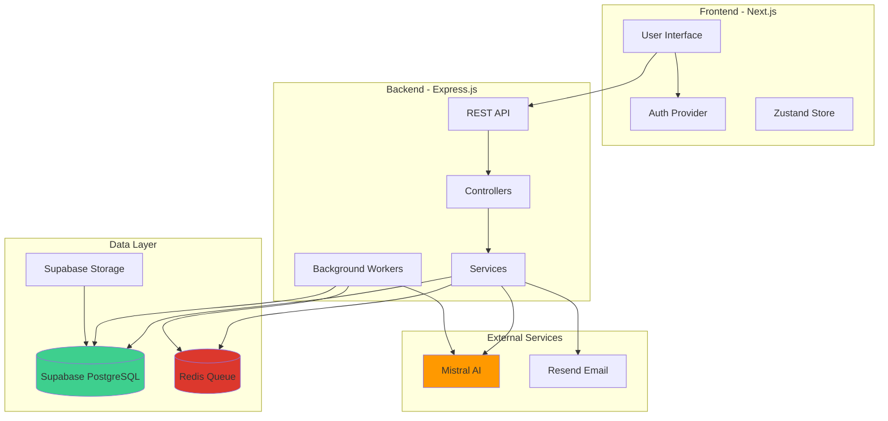
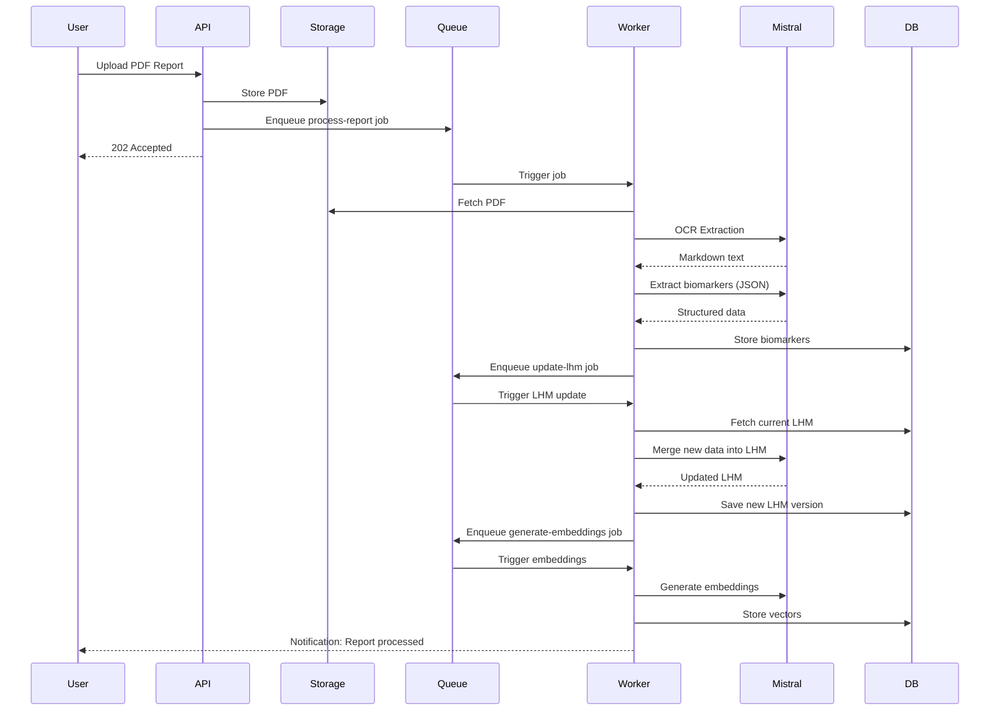
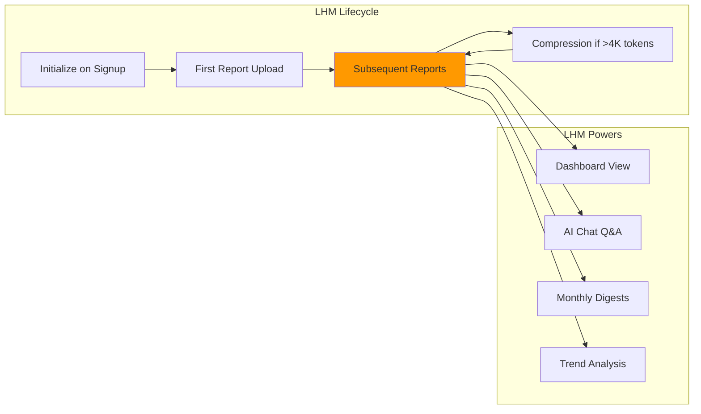

# Vitals - Together Towards Healthier Tomorrow

> Transform your medical reports into actionable health insights with AI. Track biomarkers, visualize trends, and get personalized health guidance for your entire family under one roof.

[](LICENSE)
[](https://nodejs.org/)
[](https://www.typescriptlang.org/)
[](https://mistral.ai/)

---


## Table of Contents

- [Table of Contents](#table-of-contents)
- [Demo & Video](#demo--video)
- [Overview](#overview)
- [Why Vitals?](#why-vitals)
- [Top Features](#top-features)
- [Architecture](#architecture)
- [Tech Stack](#tech-stack)
- [Getting Started](#getting-started)
- [Usage Guide](#usage-guide)
- [Mistral AI Capabilities](#mistral-ai-capabilities)
- [Database Schema](#database-schema)
- [API Documentation](#api-documentation)
- [Resources](#resources)
- [Contributing](#contributing)
- [License](#license)

---

## Demo & Video

**Live Demo**: [Try it on mobile!](https://vitals-rho.vercel.app)

**Demo Video**: [Watch on YouTube](https://youtu.be/mt6oHAHMWjc)

---

## Overview

Vitals is a comprehensive health management platform that helps individuals and families track, understand, and act on their medical data. Upload your lab reports, and let AI do the heavy lifting - extracting biomarkers, tracking trends, and providing personalized insights.

### Key Highlights

- **AI-Powered OCR**: Automatically extract data from PDF lab reports using Mistral AI
- **Smart Analytics**: Track 60+ biomarkers with trend visualization and anomaly detection
- **Family Management**: Manage health records for multiple family members
- **Intelligent Chat**: Ask questions about your health data with RAG-powered Q&A
- **Monthly Reminders**: Automated email digests with health summaries and checkup reminders
- **Visual Trends**: Interactive charts showing biomarker changes over time
- **Privacy First**: Row-level security with Supabase, your data stays yours

---

## Why Vitals?

### The Problem

Medical reports are complex, scattered, and hard to interpret. Most people:
- Store reports as PDFs in folders, losing track over time
- Can't easily compare values across multiple reports
- Don't understand what their biomarker trends mean
- Miss important health changes that develop gradually
- Forget to schedule regular checkups

### The Solution

Vitals transforms your medical reports into a **Living Health Markdown (LHM)** - a continuously updated, AI-maintained health profile that:
- Consolidates all your health data in one place
- Automatically tracks trends and flags anomalies
- Provides plain-English explanations of your results
- Reminds you when checkups are due
- Answers your health questions using your actual data

### Research-Backed Importance

Regular health tracking is crucial for early disease detection and prevention:

- **Early Detection**: Biomarker tracking enables early detection and risk stratification of cardiovascular diseases, chronic kidney disease, and other conditions years before symptoms appear
  - [Advancements in biomarkers for cardiovascular disease detection](https://pubmed.ncbi.nlm.nih.gov/40432692/)
  - [Emerging biomarkers for early detection of chronic kidney disease](https://pubmed.ncbi.nlm.nih.gov/35455664/)
  - [Biomarkers for early detection of Alzheimer's disease](https://pubmed.ncbi.nlm.nih.gov/27738903/)

- **Chronic Disease Management**: Regular health checkups can reduce mortality risk by half through early detection and treatment of chronic diseases
  - [Times of India: Regular health check-ups cut death risk by half](https://timesofindia.indiatimes.com/city/delhi/regular-health-check-up-cuts-death-risk-by-half/articleshow/121657241.cms)

- **Preventive Care**: Routine preventive care and screenings help catch diseases early, reducing disease, disability, and death
  - [CDC: Chronic Disease Prevention and Health Promotion](https://www.cdc.gov/chronic-disease/prevention/preventive-care.html)
  - [Healthy People 2030: Preventive Care Objectives](https://odphp.health.gov/healthypeople/objectives-and-data/browse-objectives/preventive-care)
  - [HealthCare.gov: Preventive Care Benefits](https://www.healthcare.gov/preventive-care-adults/)

---

## Top Features

### 1. Intelligent Report Processing

Upload PDF lab reports and watch AI extract every biomarker automatically:
- Supports all major Indian labs (Thyrocare, Dr Lal PathLabs, SRL, Metropolis, etc.)
- Extracts 60+ biomarkers including CBC, lipid panel, kidney function, liver function, thyroid, diabetes markers, and more
- Normalizes values across different lab formats
- Preserves reference ranges and flags abnormal values

### 2. Family Health Management

Manage health records for your entire family from one account:
- Create profiles for spouse, children, parents, and other dependents
- Each profile gets its own Living Health Markdown (LHM)
- Track different health conditions for different family members
- Set individual checkup reminders and notification preferences

### 3. Visual Trend Analysis

See how your health metrics change over time:
- Interactive line charts for each biomarker
- Color-coded status indicators (High, Borderline, Normal)
- Trend arrows showing improvement or deterioration
- Historical comparison across multiple reports
- Export charts as images for doctor consultations

### 4. AI Health Assistant

Ask questions about your health data in natural language:
- "What's my average blood sugar over the last year?"
- "Is my cholesterol improving?"
- "When should I schedule my next checkup?"
- Powered by RAG (Retrieval-Augmented Generation) for accurate, context-aware answers
- Responses based on YOUR actual data, not generic advice

### 5. Monthly Health Digests

Never miss a checkup with automated email reminders:
- Monthly summary of your health status
- Highlights of significant changes since last month
- Checkup reminders when reports are overdue
- Personalized recommendations based on trends
- Configurable notification preferences per profile

### 6. Enterprise-Grade Security

Your health data is sensitive. We protect it with:
- Row-Level Security (RLS) in Supabase
- Encrypted data at rest and in transit
- Secure authentication with Supabase Auth
- HIPAA-compliant infrastructure ready
- No data sharing with third parties

---

## Architecture

### System Overview



### Data Flow: Report Processing Pipeline



### Living Health Markdown (LHM) Architecture

The LHM is the core innovation of Vitals - a single, continuously updated markdown document per profile that serves as the source of truth for all health data.



**Why LHM?**
- Single source of truth for each profile's health
- Pre-computed insights reduce API calls
- Human-readable and LLM-friendly format
- Preserves historical context across reports
- Enables coherent, context-aware AI responses

---

## Tech Stack

### Backend
- **Runtime**: Node.js 20+
- **Framework**: Express.js 4.18
- **Language**: TypeScript 5.3+
- **Database**: PostgreSQL 15 (Supabase Cloud)
- **Vector DB**: pgvector (for embeddings)
- **Queue**: BullMQ + Redis
- **Auth**: Supabase Auth (JWT-based)
- **Storage**: Supabase Storage (S3-compatible)

### AI & ML
- **OCR**: Mistral Pixtral 12B (vision model)
- **Chat**: Mistral Large (32K context window)
- **Embeddings**: Mistral Embed (1024 dimensions)
- **RAG**: Custom implementation with pgvector

### Frontend
- **Framework**: Next.js 14 (App Router)
- **Language**: TypeScript
- **Styling**: Tailwind CSS
- **State**: Zustand
- **Data Fetching**: TanStack Query (React Query)
- **Charts**: Recharts
- **Auth**: Supabase Auth Client

### DevOps & Infrastructure
- **Hosting**: Railway (backend), Vercel (frontend)
- **CI/CD**: GitHub Actions
- **Monitoring**: Railway Logs
- **Email**: Resend
- **Package Manager**: pnpm

### Development Tools
- **Linting**: ESLint + Prettier
- **Type Checking**: TypeScript strict mode
- **Testing**: Jest (unit tests)
- **API Testing**: Thunder Client / Postman
- **Database Migrations**: Supabase CLI

---

## Getting Started

### Prerequisites

- Node.js 20+ and pnpm
- Supabase account (free tier works)
- Redis instance (free tier from Redis Cloud)
- Mistral AI API key
- Resend API key (for emails)

### Installation

1. **Clone the repository**
```bash
git clone https://github.com/adityaghai07/vitals.git
cd vitals
```

2. **Install dependencies**
```bash
pnpm install
```

3. **Set up environment variables**
```bash
cp .env.example .env
```

Edit `.env` with your credentials:
```env
# Supabase
SUPABASE_URL=your-project-url
SUPABASE_ANON_KEY=your-anon-key
SUPABASE_SERVICE_ROLE_KEY=your-service-role-key

# Redis
REDIS_URL=redis://your-redis-url

# Mistral AI
MISTRAL_API_KEY=your-mistral-api-key

# Resend Email
RESEND_API_KEY=your-resend-api-key
FROM_EMAIL=noreply@yourdomain.com
```

4. **Set up database**
```bash
# Install Supabase CLI
npm install -g supabase

# Link to your project
pnpm db:link

# Push migrations
pnpm db:push

# Generate TypeScript types
pnpm db:types

# Verify setup
pnpm db:check
```

5. **Start development server**
```bash
pnpm dev
```

Server runs on `http://localhost:3000`

### Frontend Setup

```bash
cd frontend
pnpm install
cp .env.local.example .env.local
# Edit .env.local with your Supabase credentials
pnpm dev
```

Frontend runs on `http://localhost:3001`

---

## Usage Guide

### 1. Create an Account

```bash
POST /api/auth/signup
{
  "email": "user@example.com",
  "password": "securepassword",
  "name": "John Doe"
}
```

### 2. Create Family Profiles

```bash
POST /api/profiles
{
  "name": "Jane Doe",
  "relationship": "spouse",
  "dateOfBirth": "1985-05-15",
  "gender": "female"
}
```

### 3. Upload a Lab Report

```bash
POST /api/reports
Content-Type: multipart/form-data

profileId: <profile-id>
file: <pdf-file>
reportDate: 2025-01-15
labName: Thyrocare
```

### 4. View Dashboard

```bash
GET /api/dashboard/:profileId
```

Returns:
- Current health snapshot
- Biomarkers categorized by status
- Recent trends
- Checkup reminders

### 5. Ask Health Questions

```bash
POST /api/chat
{
  "profileId": "<profile-id>",
  "message": "What's my average blood sugar over the last 6 months?"
}
```

### 6. View Biomarker Trends

```bash
GET /api/biomarkers/:profileId/trends?biomarkerName=fasting_blood_sugar
```

Returns historical data for charting.

---

## Mistral AI Capabilities

Vitals leverages three Mistral AI models for different tasks:

### 1. Pixtral 12B (OCR)

**Purpose**: Extract text and tables from PDF medical reports

**Features**:
- Vision-based model that understands document layout
- Preserves table structure in markdown format
- Handles various lab report formats
- Temperature: 0.1 (low for consistent extraction)
- Max tokens: 4000 per report

**Example**:
```typescript
const markdown = await mistralOCRService.extractTextFromPDF(pdfBuffer, 'report.pdf');
// Returns structured markdown with tables intact
```

### 2. Mistral Large (Chat & Analysis)

**Purpose**: Generate insights, answer questions, and update LHM

**Features**:
- 32K token context window
- Structured output (JSON mode)
- Streaming support for real-time responses
- Temperature: 0.7 (balanced creativity)
- Powers chat, LHM updates, and email digests

**Example**:
```typescript
// Chat Q&A
const answer = await mistralChatService.complete([
  { role: 'system', content: 'You are a health assistant.' },
  { role: 'user', content: 'Explain my cholesterol results' }
]);

// Structured extraction
const biomarkers = await mistralChatService.extractStructured(
  'Extract biomarkers as JSON',
  ocrText,
  '{ biomarkers: [{ name: string, value: number, unit: string }] }'
);
```

### 3. Mistral Embed (Semantic Search)

**Purpose**: Generate vector embeddings for RAG-powered Q&A

**Features**:
- 1024-dimensional vectors
- Batch processing (up to 16 texts)
- Intelligent text chunking (500 tokens)
- Cosine similarity for semantic search
- Stored in pgvector for fast retrieval

**Example**:
```typescript
// Generate embedding for user question
const queryEmbedding = await mistralEmbedService.embed(userQuestion);

// Search similar content in database
const relevantChunks = await searchSimilarEmbeddings(queryEmbedding);

// Use chunks as context for chat
```

### Cost Optimization

- OCR: ~$0.01 per report (4K tokens)
- Chat: ~$0.002 per query (average 1K tokens)
- Embeddings: ~$0.0001 per chunk (cached in DB)
- Monthly cost for active user: ~$2-5

---

## Database Schema

### Core Tables

```sql
-- Users (managed by Supabase Auth)
users (
  id UUID PRIMARY KEY,
  email TEXT UNIQUE,
  created_at TIMESTAMPTZ
)

-- Profiles (family members)
profiles (
  id UUID PRIMARY KEY,
  user_id UUID REFERENCES users(id),
  name TEXT,
  relationship TEXT,
  date_of_birth DATE,
  gender TEXT,
  created_at TIMESTAMPTZ
)

-- Reports
reports (
  id UUID PRIMARY KEY,
  profile_id UUID REFERENCES profiles(id),
  user_id UUID REFERENCES users(id),
  file_path TEXT,
  report_date DATE,
  lab_name TEXT,
  status TEXT, -- 'pending', 'processing', 'completed', 'failed'
  created_at TIMESTAMPTZ
)

-- Biomarkers
biomarkers (
  id UUID PRIMARY KEY,
  report_id UUID REFERENCES reports(id),
  profile_id UUID REFERENCES profiles(id),
  name TEXT,
  value NUMERIC,
  unit TEXT,
  reference_range TEXT,
  status TEXT, -- 'normal', 'high', 'low', 'borderline'
  created_at TIMESTAMPTZ
)

-- Living Health Markdown
user_health_markdown (
  profile_id UUID PRIMARY KEY REFERENCES profiles(id),
  user_id UUID REFERENCES users(id),
  markdown TEXT,
  version INT DEFAULT 1,
  last_updated_at TIMESTAMPTZ,
  last_report_date DATE,
  tokens_approx INT
)

-- Embeddings (for RAG)
report_embeddings (
  id UUID PRIMARY KEY,
  report_id UUID REFERENCES reports(id),
  profile_id UUID REFERENCES profiles(id),
  chunk_text TEXT,
  embedding VECTOR(1024), -- pgvector type
  created_at TIMESTAMPTZ
)

-- Notification Settings
notification_settings (
  user_id UUID PRIMARY KEY REFERENCES users(id),
  email_enabled BOOLEAN DEFAULT true,
  digest_frequency TEXT DEFAULT 'monthly',
  reminder_days_before INT DEFAULT 7
)
```

### Indexes

```sql
-- Performance indexes
CREATE INDEX idx_biomarkers_profile ON biomarkers(profile_id, created_at DESC);
CREATE INDEX idx_reports_profile ON reports(profile_id, report_date DESC);
CREATE INDEX idx_embeddings_vector ON report_embeddings USING ivfflat (embedding vector_cosine_ops);
```

### Row-Level Security (RLS)

All tables have RLS policies ensuring users can only access their own data:

```sql
-- Example: Profiles RLS
CREATE POLICY "Users can view own profiles"
  ON profiles FOR SELECT
  USING (auth.uid() = user_id);

CREATE POLICY "Users can insert own profiles"
  ON profiles FOR INSERT
  WITH CHECK (auth.uid() = user_id);
```

---

## API Documentation

### Authentication

All endpoints (except `/api/auth/*`) require authentication via Supabase JWT token:

```bash
Authorization: Bearer <supabase-jwt-token>
```

### Endpoints

#### Auth

```bash
POST   /api/auth/signup          # Create account
POST   /api/auth/login           # Login
GET    /api/auth/me              # Get current user
```

#### Profiles

```bash
GET    /api/profiles             # List all profiles
POST   /api/profiles             # Create profile
GET    /api/profiles/:id         # Get profile details
PATCH  /api/profiles/:id         # Update profile
DELETE /api/profiles/:id         # Delete profile
```

#### Reports

```bash
POST   /api/reports              # Upload report (multipart/form-data)
GET    /api/reports              # List reports (query: profileId)
GET    /api/reports/:id          # Get report details
DELETE /api/reports/:id          # Delete report
```

#### Dashboard

```bash
GET    /api/dashboard/:profileId # Get health dashboard
```

Response:
```json
{
  "profile": { "id": "...", "name": "..." },
  "summary": {
    "totalReports": 5,
    "lastCheckup": "2025-01-15",
    "nextCheckupDue": "2025-07-15",
    "daysUntilCheckup": 136
  },
  "biomarkers": {
    "needsAttention": [...],
    "borderline": [...],
    "normal": [...]
  },
  "recentTrends": [...]
}
```

#### Biomarkers

```bash
GET    /api/biomarkers/:profileId/trends?biomarkerName=fasting_blood_sugar
```

Response:
```json
{
  "biomarkerName": "fasting_blood_sugar",
  "unit": "mg/dL",
  "referenceRange": "70-110",
  "data": [
    { "date": "2025-01-15", "value": 145, "status": "high" },
    { "date": "2024-07-20", "value": 132, "status": "high" },
    { "date": "2024-01-10", "value": 118, "status": "borderline" }
  ]
}
```

#### Chat

```bash
POST   /api/chat                 # Ask health question
```

Request:
```json
{
  "profileId": "uuid",
  "message": "What's my cholesterol trend?"
}
```

Response (streaming):
```
data: {"chunk": "Your "}
data: {"chunk": "cholesterol "}
data: {"chunk": "has improved..."}
data: [DONE]
```

#### Notifications

```bash
GET    /api/settings/notifications        # Get notification settings
PATCH  /api/settings/notifications        # Update settings
```

---

## Resources

### Code & Writeup

- **GitHub Repository**: [github.com/adityaghai07/vitals](https://github.com/adityaghai07/vitals)

### Demo & Video

- **Live Demo**: [Try Vitals](https://vitals-rho.vercel.app)
- **Demo Video**: [Watch on YouTube](https://youtu.be/mt6oHAHMWjc)
- **Demo Video**: [YouTube link - 5-minute walkthrough]

### Research & References

#### Why Health Tracking Matters

1. **Early Disease Detection**
   - [PubMed: Biomarkers for cardiovascular disease detection](https://pubmed.ncbi.nlm.nih.gov/40432692/)
   - [PubMed: Early detection of chronic kidney disease](https://pubmed.ncbi.nlm.nih.gov/35455664/)
   - [PubMed: Biomarkers for Alzheimer's disease progression](https://pubmed.ncbi.nlm.nih.gov/27738903/)
   - Biomarker tracking enables detection of conditions years before symptoms appear

2. **Chronic Disease Management**
   - [Times of India: Regular health check-ups cut death risk by half](https://timesofindia.indiatimes.com/city/delhi/regular-health-check-up-cuts-death-risk-by-half/articleshow/121657241.cms)
   - Early detection and treatment through regular monitoring significantly reduces mortality risk

3. **Preventive Healthcare**
   - [CDC: Chronic Disease Prevention](https://www.cdc.gov/chronic-disease/prevention/preventive-care.html)
   - [Healthy People 2030: Preventive Care](https://odphp.health.gov/healthypeople/objectives-and-data/browse-objectives/preventive-care)
   - [HealthCare.gov: Preventive Services](https://www.healthcare.gov/preventive-care-adults/)
   - Routine screenings and preventive care reduce disease, disability, and death

4. **Patient Empowerment**
   - [Harvard Health: Activity trackers increase exercise](https://www.health.harvard.edu/exercise-and-fitness/do-activity-trackers-make-us-exercise-more)
   - [Harvard Health: Wearable fitness trackers for heart health](https://www.health.harvard.edu/heart-health/smarter-safer-workouts-with-a-wearable-fitness-tracker)
   - Fitness trackers linked to ~1,200 more steps/day and ~49 extra minutes of moderate activity/week
   - Patients who actively track their health are more engaged and have better outcomes

#### Technology References

- [Mistral AI Documentation](https://docs.mistral.ai/)
- [Supabase Documentation](https://supabase.com/docs)
- [BullMQ Queue System](https://docs.bullmq.io/)
- [pgvector for Embeddings](https://github.com/pgvector/pgvector)
- [RAG Architecture Best Practices](https://www.pinecone.io/learn/retrieval-augmented-generation/)

---

## Product 


---

## Roadmap

### Phase 1: MVP (Current)
- PDF upload and OCR
- Biomarker extraction and normalization
- Living Health Markdown (LHM)
- Dashboard with trend visualization
- AI-powered chat Q&A
- Family profile management
- Monthly email digests

### Phase 2: Enhanced Features
- Mobile app (React Native)
- Doctor consultation booking
- Medication tracking
- Symptom logging
- Health goal setting
- Export reports as PDF

### Phase 3: Advanced Analytics
- Predictive health insights
- Personalized recommendations
- Integration with wearables (Fitbit, Apple Health)
- Telemedicine integration
- Insurance claim assistance

### Phase 4: Enterpriss
- Corporate wellness programs
- Multi-tenant architecture
- HIPAA compliance certification
- Advanced analytics dashboard
- API for third-party integrations

---

## Contributing

We welcome contributions! Here's how you can help:

### Development Setup

1. Fork the repository
2. Create a feature branch: `git checkout -b feature/amazing-feature`
3. Make your changes
4. Run tests: `pnpm test`
5. Run linting: `pnpm lint:fix`
6. Commit: `git commit -m 'Add amazing feature'`
7. Push: `git push origin feature/amazing-feature`
8. Open a Pull Request

### Contribution Guidelines

- Follow the existing code style (ESLint + Prettier)
- Write meaningful commit messages
- Add tests for new features
- Update documentation as needed
- Keep PRs focused and small

### Areas We Need Help

- Bug fixes and testing
- Documentation improvements
- Internationalization (i18n)
- UI/UX enhancements
- Security audits
- Accessibility improvements

---

## License

This project is licensed under the MIT License - see the [LICENSE](LICENSE) file for details.

---

## Acknowledgments

- **Mistral AI** for providing powerful AI models
- **Supabase** for the excellent backend-as-a-service platform
- **Railway** for seamless deployment
- **Open source community** for the amazing tools and libraries

---

## Support

- **Issues**: [GitHub Issues](https://github.com/adityaghai07/vitals/issues)
- **Discussions**: [GitHub Discussions](https://github.com/adityaghai07/vitals/discussions)
- **Email**: willaddsoon!

---

<div align="center">

**Built with care for better health outcomes**

 • [Demo](https://vitals-rho.vercel.app)

</div>
